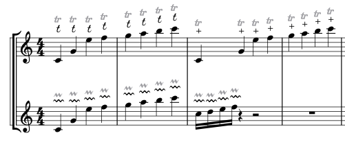

# musescore-plugin-baroque-trills-engraver
Replace default trills with baroque style ones

## Trill_replace_+.qml
- hides default trill and replace it by Baroque Shake "+" symbol

## Trill_replace_t.qml
- hides default trill and replace it by Baroque Shake Muffat "t" symbol

## Trill_replace_Treblement_Couperin.qml
- hides default short trill and replace it by Couperin Treblement symbol

## Trill_restore.qml
- removes baroque symbols and restore default ornament symbols

## Trill_adjust.qml
- reset positions of baroque symbols (useful f.ex. after creating parts from score, ...)
